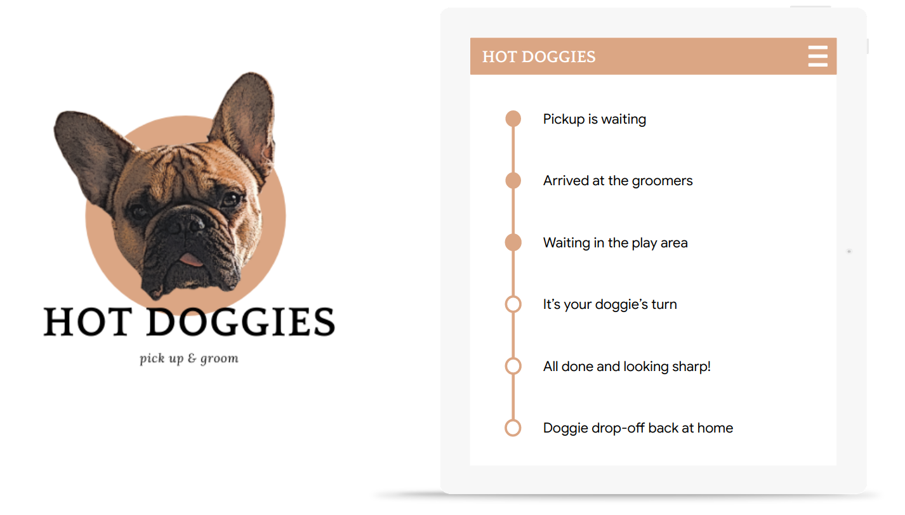
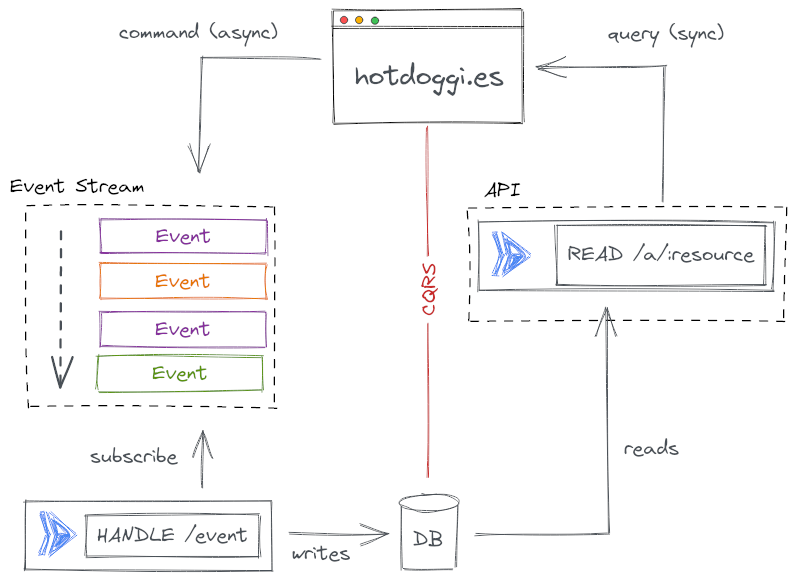
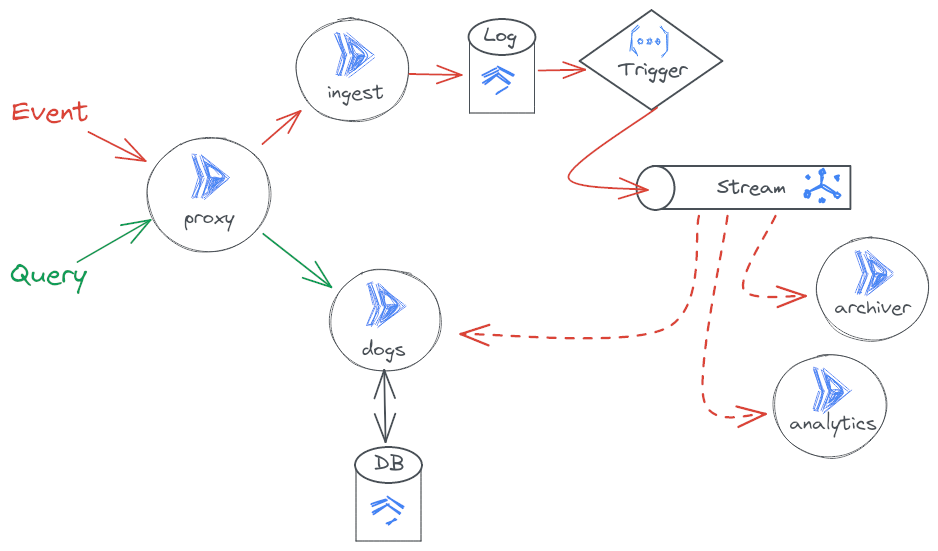
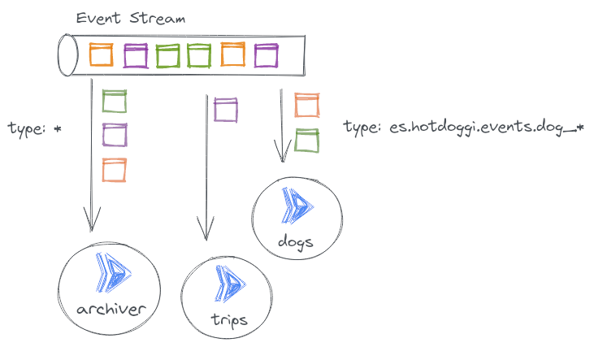
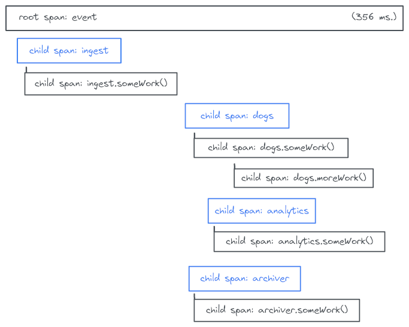

<!--
Copyright 2022 Daniel Stamer

Licensed under the Apache License, Version 2.0 (the "License");
you may not use this file except in compliance with the License.
You may obtain a copy of the License at

    http://www.apache.org/licenses/LICENSE-2.0

Unless required by applicable law or agreed to in writing, software
distributed under the License is distributed on an "AS IS" BASIS,
WITHOUT WARRANTIES OR CONDITIONS OF ANY KIND, either express or implied.
See the License for the specific language governing permissions and
limitations under the License.
-->

# Hotdoggi.es

Hotdoggi.es is a demo application to showcase modern and contemporary application architectures on Google Cloud serverless technologies. It is built to support common use cases such as API-driven microservices architectures, JAM stacks, contemporary end-user and service-to-service authentication, event-driven patterns, Command Query Responsibility Segregation designs and distributed tracing in event-based architectures.



The application implements a fictional business that provides digital convenience services to dog-owning customers. Users can register their pups and book trips to dog spas through the application. Drivers will collect the dog from a place of residence and chauffeur them to a spa or a dog hotel, where they can enjoy a beautiful day away from home socializing with others. During the trip, a multitude of event sources will emit updates about the dog so that the owning user can observe everything that happens from the comfort of their screens at home or on the go.

## Architectural Patterns
Multiple contemporary patterns have been implemented in the applications design and can be observed by inspecting the code or deploying the application to a Google Cloud project.

### JAM Stack: Static Serving

The frontend of the application is using the JAM Stack (JavaScript, APIs and Markup) pattern. A React application in `app/`, is integrated by Cloud Build and its production-optimized build is rsync-ed to a Google Cloud Storage bucket which serves as an origin backend for Google Cloud External HTTPS Load Balancing. Additionally, the serving of these static assets is accelerated through Google Cloud CDN.


### JAM Stack: API Frontend

The A in JAM Stack stands for APIs and implements the frontend access to dynamic data via a RESTful API surface. The API is defined as an OpenAPI/Swagger specification that is uploaded to Cloud Endpoints, where it defines the API and registers it within Google's Service Management API. The proxy then pulls that configuration from the control plane and acts as an API gateway to all requests.


### CQRS

Command Query Responsibility Segregation (CQRS) introduces the idea of distinguishing between synchronous read-only 'query' operations and asynchronous operations that eventually mutate (persistent) state. In other words: the 'Q' stands for all interactions in which data is read 'real-time'/now and the 'C' groups actions which create, update or delete data, but not necessarily right away. The command portion is therefore often implemented as an event-driven system, which accepts a command, quickly pushes it as an event through the rest of the architecture and responds quickly to the requestor even though the command has not yet been processed, hence, introducing the asynchronicity. The synchronous query portion remains as a conventional synchronous API.

*NOTE:* In the context of this demo, commands & events are treated synonymously and refer to their asynchronous processing nature and resulting technically different implementation. In the context of another application, it might seem reasonable to distinguish them (at least semantically).

CQRS brings a number of architectural advantages. Operators can independently scale commands and queries. It's much easier to scale and optimize a read-heavy application if the query portion remains on a separate partition in the system. This can roughly be compared to using read-replicas to reduce read- contention in relational database systems. Additionally, caching of dynamic content becomes a bit easier.



The segregation is enforced at the API layer. Resources known to the API continue to expose read-only methods, such as getting individual resources or listing multiple of a kind, just like they would in conventional RESTful design. The difference is that all state-mutating commands are all POSTed through a single `/events` endpoint, which is served by a generic ingestion service. This service accepts, inspects, validates and pushed event payloads downstream into the rest of the event-driven architecture, where the command will be processed at a later stage.



### Websockets

Read-only queries can be seamlessly upgraded to streaming Websocket connections. The endpoints do not change and the methods are the same as for regular, short-lived HTTP requests. The client can simply initiate a Websocket connection upgrade by including the necessary HTTP headers. The API will then respond with an HTTP 101 status and signal that it's ready to upgrade to HTTP/2 for websocket streaming connections in which the server will continuously stream the same JSON-serialized objects for updated objects back to the client.


### Event-Sourcing and CloudEvents.io

This demo application implements event-sourcing. Every change to the state of the system and its databases is ingested as an event. All events are validated and are transactionally-safe inserted into an event-log before being exposed to the rest of the system for processing. The entire state of the system can be reproduced by replaying events. Its easy to create separate, isolated environments and fan-out or replay events into these for testing purposes.

Please note that a strictly event-sourced system is not always a great match for most applications: there are a lot of use-cases in which the concepts of event-sourcing are simply too strict and some of the intrinsic behaviors and design concepts could pose to be an obstacle or limit flexibility. This demo can easily be modified and 'downgraded' from event-sourced design to a less strict form of event-driven architecture. The event-log can be omitted, so that incoming, validated events could directly be passed onto the Pub/Sub messaging topic for further processing. In this option, one would lose the capability of re-playing events directly from the event-log. It is highly recommended to substitute the functionality of the event-log by other means. An archive of all processed events can be kept on cheap blob storage (shown in the demo) in order to replay events. Alternatively, database backups are also always a viable option to be able to recreate the state of the system rather than replaying events. Removing the event-log would also help to reduce cost of the architecture.

In this concrete demo application, the `ingest` service accepts raw event payloads that are being POSTed in though the API at '/events'. The service authenticates, validates and inserted the event into Firestore, which serves as the event-log. Certain properties, like precise timestamps, are inserted by Firestore. Once Firestore commits an insertion transaction, the database emits an event which is picked up by a Cloud Function. The `trigger` function pulls the newly created event from the database, deserializes it as a CloudEvent and publishes it onto Pub/Sub. Apart from model validation there is no distinction or differentiation between event types up until this point. All events are treated equally and end up on a single `$all` topic.


The following shows a sample event as it would be emitted from one of the sources, e.g. the web application. It is the type of raw event that would be accepted if it were POSTed to /events/es.hotdoggi.events.dog_added/web with the intent of adding a new dog to the ones owned by the user.

```json
{
    "dog": {
        "name": "Brudi",
        "breed": "French Bulldog",
        "birthday": "2017-01-29",
        "color": "Brown",
        "picture": "https://pbs.twimg.com/profile_images/1113006798817103873/wOnfFCHR_400x400.jpg",
        "location": {
            "latitude": 9,
            "longitude": 64
        }
    }
}
```

As the event passes through the event-sourcing flow, it gets enriched with additional information, like user context, time stamp, trace information, etc. Additionally the event is handled as a [CloudEvents.io](https://cloudevents.io) type. An event that gets pushed into one of the consumers would look something like the following.

```json
{
    "id": "123-long-unique-event-id",
    "source": "web",
    "type": "es.hotdoggi.events.dog_added",
    "specversion": "1.0",
    "subject" : "hotdoggi.es",
    "time" : "2018-04-05T17:31:00Z",
    "datacontenttype" : "application/json",
    "traceparent": "00-83f2290b448fd67fc256120851b7bd96-37d2d81ac8fa063f-00", 
    "data" : {
        "principal": {
            "user_id": "123-long-unique-user-id",
            "name": "Daniel Stamer",
            "email": "dan@hello-world.sh",
            "picture": "https://example.com-avatar.png"
        },
        "ref": {
            "id": "",
            "dog":{
                "name": "Brudi",
                "breed": "French Bulldog",
                "birthday": "2017-01-29",
                "color": "Brown",
                "picture": "https://pbs.twimg.com/profile_images/1113006798817103873/wOnfFCHR_400x400.jpg",
                "location": {
                    "latitude": 9,
                    "longitude": 64
                }
            }
        }
    }
}
```

### Event Choreography

Hotdoggi.es pushes all incoming events to a single `$all` Pub/Sub topic. Among other envelope metadata from the CloudEvents specification, all messages on the Pub/Sub topic keep the event type as a message attribute. Various Cloud Run services can then subscribe to the the specific events they are interested in by setting up a push subscription and implementing the HTTP POST event handlers.

The choreography patterns of free-floating self-organization is extremely helpful here because it enables teams to seamlessly extend the functionality of the entire architecture by simply creating additional services and subscribing to the common event stream. Unlike an orchestration pattern, it is not required to make changes to a central router. This can be seen in [the subscription of the dogs service](https://github.com/helloworlddan/hotdoggi.es/blob/main/infrastructure/dogs.tf#L86).

The combination of push-subscriptions delivered into highly elastic, auto-scaled consuming services (like Cloud Run) is very effective as users don't need to worry about scaling message queues. Such an architecture is cost-effective at processing low rates of events and at the same time is capable for processing tens of thousands of events in seconds without any external operational adjustments.



### End-user & Service-to-Service Authentication 

The application follows a strong, identity-based authentication flow in which nothing is trusted and each end-user or service-to-service invokation is validated and verified.

Each invocation originating from outside of Google Cloud needs to be authenticated with `Authorization: bearer $TOKEN` headers. These tokens need to be obtained by authenticating with username/password or with one of the configured social login providers which currently are Google and Github. Hotdoggi.es uses [Identity Platform](https://cloud.google.com/identity-platform) and there are many more social login providers available. The [hotdoggi.es frontend](https://hotdoggies.stamer.demo.altostrat.com/) implements the authentication flow using the Firebase Authentication libraries.

All inbound requests are routed through the ESPv2 endpoint proxy which will inspect and verify issued tokens with Identity Platform before passing them onto the downstream services. Once authenticated, the original authorization headers are moved to `X-Forwarded-Authorization` and the proxy uses it's service account to obtain it's own token to be put into `Authorization: bearer $TOKEN` headers. This effectively encapsulates and forwards the original end-user authentication between client and proxy and uses service-to-service authentication between the proxy and downstream services like `dogs`.

The Cloud Run service running the proxy allows unauthenticated invocations, meaning that Cloud Run is not checking supplied credentials, but the running ESPv2 container will. The downstream services like `dogs` require authentication and Cloud Run will check authorization headers before passing inbound requests to the actual service code. This ensures strong service-to-service authentication and checks for authorization, too: Only the proxy's service account identity is allowed to directly invoke the downstream services. It can't be called directly from anywhere else/with any other identity, hence end-user authentication via the proxy is absolutely required.


Additionally, services in hotdoggi.es will occasionally require communication with Google Cloud services and APIs. For example, the `dogs` service needs to query items in Firestore and each interaction with the APIs need to be authenticated in a similar fashion. Each service is using a non-standard service account which is given exact permissions to be able to it's job.

### Distributed Tracing

The code execution within services of this demo is instrumented using OpenTelemetry. Each service records it's various code spans and prefixes them with a service identifier, before batch-exporting the recorded traces to Google Cloud Trace, where trace data is reconstructed and visualized for analysis.



The context of traces is propagated across services boundaries, so that a single externally-invoked interaction results in a single trace object holding spans from all services that participated in processing that interaction.

In the context of events, this demo is following the Cloudevents.io [specification extension for enabling distributed tracing](https://github.com/cloudevents/spec/blob/main/cloudevents/extensions/distributed-tracing.md). 

## Using it

There are several ways to interact with this demo.

### Local Load Generator

Traffic (both events and synchronous requests) can be generated by using a local script located at `loader/loader.py`. The load requires authentication so one needs to export an application access token to the environment before using it. The token can be obtained by visiting [the frontend app](https://hotdoggies.stamer.demo.altostrat.com). 

```bash
export TOKEN="your-access-token"
make load
```

The script will generate some random dogs, move them around artificially and finally remove them again upon graceful termination.

### Local Stream Reader

