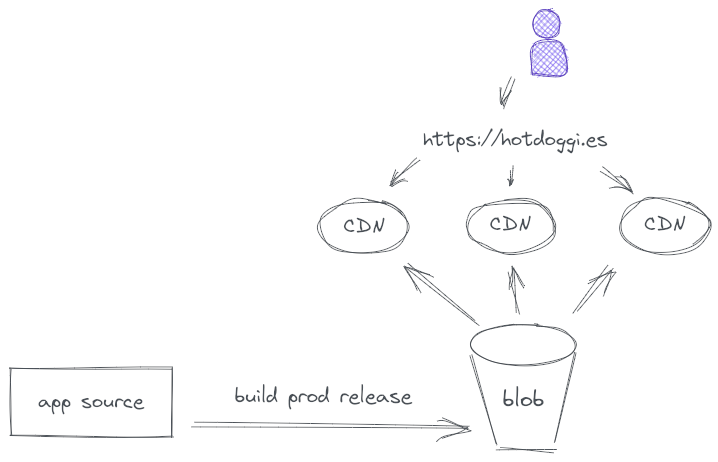

# Hotdoggi.es

Hotdoggi.es is a demo application to showcase modern and comtemporary application architectures on Google Cloud serverless technologies. It is built to support common use cases such as API-driven microservices architectures, JAM stacks, contemporary end-user and service-to-service authentication, event-driven patterns and Command Query Responsibility Segregation designs.

The application implements a fictional business that provides digital convenience services to dog-owning customers. Users can register their pups and book trips to dog spas through the application. Drivers will collect the dog from a place of residence and chauffeur them to a spa or a dog hotel, where they can enjoy a beautiful day away from home socializing with others. During the trip, a multitude of event sources will emit updates about the dog so that the owning user can observe everything that happens from the comfort of their screens at home or on the go.

## Architectural Patterns

Multiple contempory patterns have been implemented in the applications design and can be observed by inspecting the code or deploying the application to a Google Cloud project.

### JAM Stack: Static Serving

The frontend of the application is using the JAM Stack (JavaScript, APIs and Markup) pattern. A React application in `app/`, is integrated by Cloud Build and its production-optimized build is rsynced to a Google Cloud Storage bucket which serves as an origin backend for Google Cloud External HTTPS Load Balancing. Additionally, the serving of these static assets is accelerated through Google Cloud CDN.

### JAM Stack: API Frontend

The A in JAM Stack stands for APIs and implements the frontend access to dynamic data via a RESTful API surface. The API is defined as an OpenAPI/Swagger specification that is uploaded to Cloud Endpoints, where it defines the API and registers it within Google's Service Management API. The proxy then pulls that configuration from the control plane and acts as an API gateway to all requests.

### CQRS

lorem ipsum

### Event-Sourcing

lorem ipsum

### Event Choreography

lorem ipsum

### End-user & Service-to-Service Authentication 

lorem ipsum

### Tracing and Oberservability

lorem ipsum
