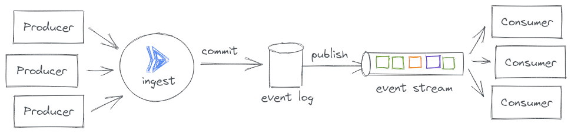

# Hotdoggi.es

Hotdoggi.es is a demo application to showcase modern and comtemporary application architectures on Google Cloud serverless technologies. It is built to support common use cases such as API-driven microservices architectures, JAM stacks, contemporary end-user and service-to-service authentication, event-driven patterns and Command Query Responsibility Segregation designs.

The application implements a fictional business that provides digital convenience services to dog-owning customers. Users can register their pups and book trips to dog spas through the application. Drivers will collect the dog from a place of residence and chauffeur them to a spa or a dog hotel, where they can enjoy a beautiful day away from home socializing with others. During the trip, a multitude of event sources will emit updates about the dog so that the owning user can observe everything that happens from the comfort of their screens at home or on the go.

## Architectural Patterns
Multiple contempory patterns have been implemented in the applications design and can be observed by inspecting the code or deploying the application to a Google Cloud project.

### JAM Stack: Static Serving

The frontend of the application is using the JAM Stack (JavaScript, APIs and Markup) pattern. A React application in `app/`, is integrated by Cloud Build and its production-optimized build is rsynced to a Google Cloud Storage bucket which serves as an origin backend for Google Cloud External HTTPS Load Balancing. Additionally, the serving of these static assets is accelerated through Google Cloud CDN.


### JAM Stack: API Frontend

The A in JAM Stack stands for APIs and implements the frontend access to dynamic data via a RESTful API surface. The API is defined as an OpenAPI/Swagger specification that is uploaded to Cloud Endpoints, where it defines the API and registers it within Google's Service Management API. The proxy then pulls that configuration from the control plane and acts as an API gateway to all requests.


### CQRS

Command Query Responsibility Segregation (CQRS) introduces the idea of distinguishing between synchronous read-only 'query' operations and asynchronous operations that eventually mutate (persistent) state. In other words: the 'Q' stands for all interactions in which data is read 'real-time'/now and the 'C' groups actions which create, update or delete data, but not necessarily right away. The command portion is therefore often implemented as an event-driven system, which accepts a command, quickly pushes it as an event through the rest of the architecture and responds quickly to the requestor even though the command has not yet been processed, hence, inroducing the asynchronicity. The synchronous query portion remains as a conventional synchronous API.

CQRS brings a number of architectural advantages. Operators can independently scale commands and queries. It's much easier to scale and optimize a read-heavy application if the query portion remains on a separate partition in the system. This can roughly be compared to using read-replicas to reduce read- contention in relational database systems. Additionally, caching of dynamic content becomes a bit easier.

The segregation is enforced at the API layer. Resources known to the API continue to expose read-only methods, such as getting individual resources or listing multiple of a kind, just like they would in conventional RESTful design. The difference is that all state-mutating commands are all POSTed through a single `/events` endpoint, which is served by a generic ingestion service. This service accepts, inspects, validates and pushed event payloads downstream into the rest of the event-driven architecture, where the command will be processed at a later stage.


### Event-Sourcing and CloudEvents.io

TODO: lorem ipsum



The following shows a sample event as it would be emitted from one of the sources, e.g. the web application. It is the type of raw event that would be accepted if it were POSTed to /events/es.hotdoggi.events.dog_added/web with the intent of adding a new dog to the ones owned by the user.

```json
{
    "dog": {
        "name": "Brudi",
        "breed": "French Bulldog",
        "birthday": "2017-01-29",
        "color": "Brown",
        "picture": "https://pbs.twimg.com/profile_images/1113006798817103873/wOnfFCHR_400x400.jpg",
        "location": {
            "latitude": 9,
            "longitude": 64
        }
    }
}
```

As the event passes through the event-sourcing flow, it gets enriched with additional information, like user context, time stamp, trace information, etc. Additionally the event is handled as a [CloudEvents.io](https://cloudevents.io) type. An event that gets pushed into one of the consumers would look something like the following.

```json
{
    "id": "123-long-unique-event-id",
    "source": "web",
    "type": "es.hotdoggi.events.dog_added",
    "specversion": "1.0",
    "subject" : "hotdoggi.es",
    "time" : "2018-04-05T17:31:00Z",
    "datacontenttype" : "application/json",
    "traceparent": "00-83f2290b448fd67fc256120851b7bd96-37d2d81ac8fa063f-00", 
    "data" : {
        "principal": {
            "user_id": "123-long-unique-user-id",
            "name": "Daniel Stamer",
            "email": "dan@hello-world.sh",
            "picture": "https://example.com-avatar.png"
        },
        "ref": {
            "id": "",
            "dog":{
                "name": "Brudi",
                "breed": "French Bulldog",
                "birthday": "2017-01-29",
                "color": "Brown",
                "picture": "https://pbs.twimg.com/profile_images/1113006798817103873/wOnfFCHR_400x400.jpg",
                "location": {
                    "latitude": 9,
                    "longitude": 64
                }
            }
        }
    }
}
```

### Event Choreography

Hotdoggi.es pushes all incoming events to a single `$all` Pub/Sub topic. Among other envelope metadata from the CloudEvents specification, all messages on the Pub/Sub topic keep the event type as a message attribute. Various Cloud Run services can then subscribe to the the specific events they are interested in by setting up a push subscription and implementing the HTTP POST event handlers.

The choreography patterns of free-floating self-organization is extremely helpful here because it enables teams to seamlessly extend the functionality of the entire architecture by simply creating additional services and subscribing to the common event stream. Unlike an orchestration pattern, it is not required to make changes to a central router. This can be seen in [the subscription of the dogs service](https://github.com/helloworlddan/hotdoggi.es/blob/main/infrastructure/dogs.tf#L86).

The combination of push-subscriptions delivered into highly elastic, autoscaled consuming services (like Cloud Run) is very effective as users don't need to worry about scaling message queues. Such an architecture is cost-effective at processing low rates of events and at the same time is capable for processing tens of thousands of events in seconds without any external operational adjustments.


### End-user & Service-to-Service Authentication 

TODO: lorem ipsum


